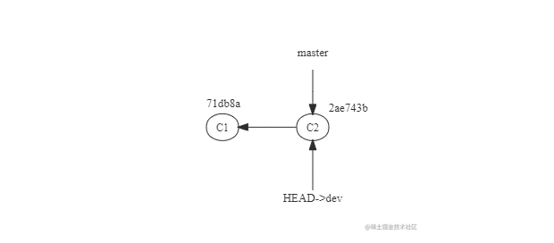

# github

Git 是一个开源的分布式版本控制系统，用于敏捷高效地处理任何或小或大的项目

## 集中式 与 分布式


## git 三大区

工作区(红色)

暂存区（绿色）

版本区(白色)

## command

### diff

```sql

比较工作区和暂存区的差异
git diff

比较暂存区和版本区的差异
git diff --cached

比较
git diff master
```

### 常用命令

```
git reset HEAD <file> : 暂存区与版本区保持一致

git checkout <file> : 暂存区覆盖工作区的内容

git rm <file> --cached : 删除暂存区文件

git commit -a -m <msg>: git add .

git reset --hard <version> : 恢复版本区指定版本的内容到工作区

git reflog : 查看引用版本号

git cherry-pick : 将已经提交的 commit，复制出新的 commit 应用到分支里

git revert :将现有的提交还原，恢复提交的内容，并生成一条新的还原记录。

```

### 分支命令

```
git branch : 查看分支

git branch dev : 创建dev分支

git checkout dev : 切换到dev分支

git checkout -b dev : 创建并切换到dev分支

git branch -d dev : 删除dev分支
```

### 合并分支

```
git merge test : 把test分支合并到当前分支
git log --oneline --graph ： 展示历史操作图

```

### git Stash

```
# stash 命令能够将还未 commit 的代码存起来，让你的工作目录变得干净。
git stash

# 保存当前未commit的代码并添加备注
git stash save "备注的内容"

# 列出stash的所有记录
git stash list

# 删除stash的所有记录
git stash clear

# 应用最近一次的stash
git stash apply

# 应用最近一次的stash，随后删除该记录
git stash pop

# 删除最近的一次stash
git stash drop
```

### git reset

```
三种模式：hard soft mixed

git reset --soft [commit_id] : 暂存区和工作区都不会被重置

--soft 模式 会在重置 HEAD 和 branch 的指针位置 的同时，保留工作区和暂存区中的内容，并把重置 HEAD 指针位置 所带来的新的差异放进暂存区（将已 commit 到仓库的内容放到暂存区）

git reset 不带参数则默认使用--mixed模式。 重置暂存区

git reset [commit_id] : 只保留工作区内容，并将已 commit 到仓库的内容和暂存区放到工作区
--mixed模式 会在重置 HEAD 和 branch 的指针位置 的同时，会保留工作目录，并将已 commit 到仓库的内容和暂存区放到工作区，并且清空暂存区。

git reset --hard [commit_id] : 重置 暂存区 和 工作区
```

# git pull 和 git fetch 的区别

- git fetch 只是将远程仓库的变化下载下来，并没有和本地分支合并。

也就是 fetch 的时候本地的 master 没有变化，但是与远程仓关联的那个版本号被更新了，接下来就是在本地 merge 合并这两个版本号的代码

- git pull 会将远程仓库的变化下载下来，并和当前分支合并。

# cherry-pick

git merge 是合并所有 commit 到其他分支，cherry-pick 是合并几个 commit

`git cherry-pick <commitHash>`

上面命令就会将指定的提交 commitHash，应用于当前分支。这会在当前分支产生一个新的提交，当然它们的哈希值会不一样。

# git merge 与 git rebase 的区别？

## 例子

1. 我们从 master 分支里拉出一条新分支为 dev 分支



2. 在 dev 分支上开发，并且完成了三次 commit,目前指针指向 C5


3. 在准备第四次提交的时候，另外一个同事在 master 主分支上进行了一次提交，master 的提交已经向前走了


此时我们知道 B 同事开发的 dev 分支是基于 C2 提交点切出来的，而这个时候 master 分支已经被更新了

如果 B 同学开发完毕，需要将其所作的功能合并到 master 分支 ，他可以有两种选择：

## 直接 git merge，那么这个时候会这么做

（1）找到 master 和 dev 的共同祖先，即 C2

（2）将 dev 的最新提交 C5 和 master 的最新提交即 C6 合并成一个新的提交 C7，有冲突的话，解决冲突

（3）将 C2 之后的 dev 和 master 所有提交点，按照提交时间合并到 master


## 直接 git rebase

切换分支到需要 rebase 的分支，这里是 dev 分支

执行 git rebase master，有冲突就解决冲突，解决后直接 git add . 再 git rebase --continue 即可

发现采用 rebase 的方式进行分支合并，整个 master 分支并没有多出一个新的 commit，原来 dev 分支上的那几次（C3，C4，C5）commit 记录在 rebase 之后其 hash 值发生了变化，不在是当初在 dev 分支上提交的时候的 hash 值了，但是提交的内容被全部复制保留了，并且整个 master 分支的 commit 记录呈线性记录


## git merge

优点：能记录真实的 commit 情况，包括每个分⽀的详情, 只需要处理一次冲突。
缺点：由于每次 merge 会⾃动产⽣⼀个 commit，因此在使用⼀些可视化的 git 工具时会看到这些自动产生的 commit，这些 commit 对于程序员来说没有什么特别的意义，多了反而会影响阅读。

## git rebase

git rebase 会合并之前的 commit 历史。

优点：可以得到更简洁的提交历史，去掉了 merge 产生的 commit
缺点：因为合并而产生的代码问题，就不容易定位，因为会重写提交历史信息。可能需要处理多次冲突。

- 相同：git merge 和 git rebase 两个命令都⽤于从⼀个分⽀获取内容并合并到当前分⽀。

- 不同点：git merge 会⾃动创建⼀个新的 commit，如果合并时遇到冲突的话，只需要修改后重新 commit。
- 场景：
  当需要保留详细的合并信息，建议使⽤ git merge, 尤其是要合并到 master 上
  当发现⾃⼰修改某个功能时提交比较频繁，并觉得过多的合并记录信息对自己来说没有必要，那么可尝试使用 git rebase

# git 冲突场景，如何解决？

## 1. 多个分值代码合并到一个分支时

## 2. 多个分支向同一个远端分支推送

## 快速合并

如果当前分支的每一个 commit 都已经存在另一个分支里面，git 就会执行一个 fast-forward 合并操作，这种情况下，git 会直接把当前分支指向另一个分支的 commit，而不会创建新的 commit。

## 冲突

<<<<<<<< 和 =====之前的区域就是当前更改的内容
========= 和 >>>>>>>>>就是传入进来更改的内容

# fork, clone 和 branch 的区别？

fork 就是复制了一个仓库的所有内容，如分支，tag，提交，如果想将你的修改合并到原项目中，可以通过 Pull Request

clone 从远程代码仓下载到本地，形成本地代码仓库，可以对本地代码进行修改，提交，推送等操作

branch 开启新的分支
