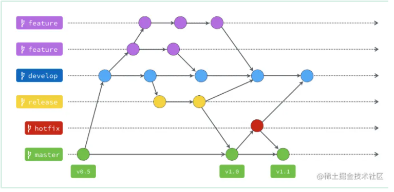

# 什么是git flow?

Git Flow 是一种基于 Git 版本控制系统构建的分支管理策略和工作流模式，旨在为大型软件开发团队提供一套结构化、可扩展且易于遵循的协作规则。

# 一、master

1.该分支主要用来存放稳定、随时可以上线的版本。

2.这个分支的来源只能从别的分支合并过来，开发者不会直接commit到这个分支上。

3.通常我们也会在这个分支上的提交打上版本号标签。

# 二、develop

1.这个分支主要是所有开发的基础分支。

2.当要添加功能时，所有功能都是从这个分支切出去的，而功能分支实现后，也都会合并回来这个分支中

# 三、hotfix (从master出来，结束后合并到master和develop)
当线上产品发生了紧急问题的时候，就会从master分支中开一个hotfix分支出来进行修复。

当hotfix分支修复完成之后，就会合并到master分支中，并且也会合并到develop分支中。

# 四、release (从develop出来，结束后合并到master和develop)
当develop分支完成需求后，就可以从develop分支中开一个release分支，进行上线前最后的测试。

测试完成后，释放release分支将会同时合并到master以及develop分支中。

# 五、feature

当我们需要补充功能的时候，就会从develop分支中开一个feature分支进行功能开发。

当功能实现后，在将feature分支合并到develop分支中，等待最后的测试发布。