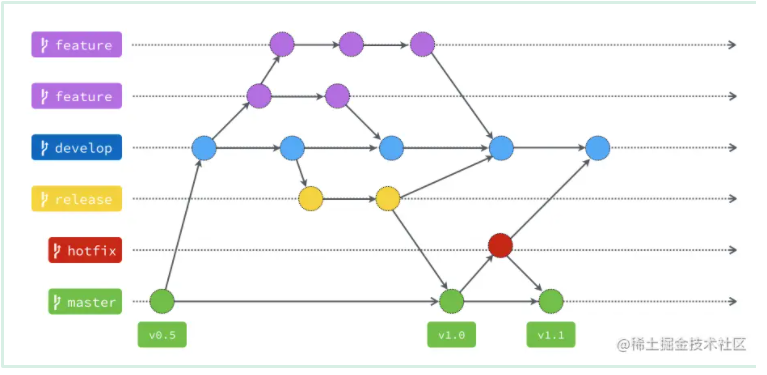

什么是git flow?

一、master

1.该分支主要用来存放稳定、随时可以上线的版本。

2.这个分支的来源只能从别的分支合并过来，开发者不会直接commit到这个分支上。

3.通常我们也会在这个分支上的提交打上版本号标签。

二、develop

1.这个分支主要是所有开发的基础分支。

2.当要添加功能时，所有功能都是从这个分支切出去的，而功能分支实现后，也都会合并回来这个分支中

三、hotfix

四、release

五、feature